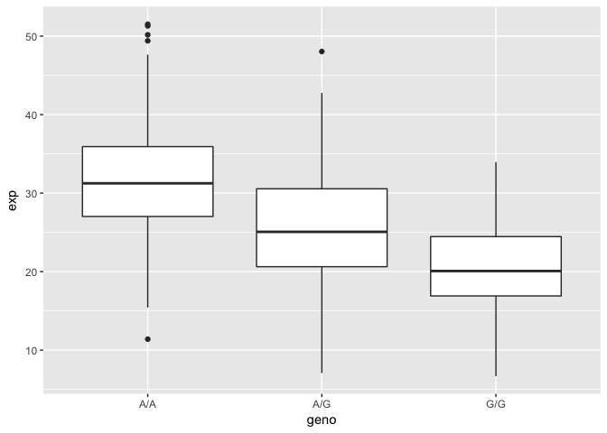
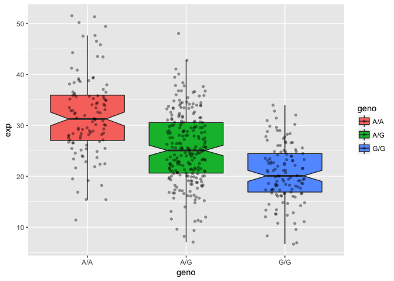

Section 4. Plotting Expression values
================
Mon May 14 22:36:01 2018

This is a complement to the hands on session for lecture 13. First we need to load our expression data from a file (that you downloaded):

``` r
#expr <- read.table("rs8067378_ENSG00000172057.6.txt")
```

Or we can read from online.

``` r
url <- "https://bioboot.github.io/bggn213_S18/class-material/rs8067378_ENSG00000172057.6.txt"
expr <- read.table(url)
```

Check the genotype sample size and overall summary stats

``` r
summary(expr)
```

    ##      sample     geno          exp        
    ##  HG00096:  1   A/A:108   Min.   : 6.675  
    ##  HG00097:  1   A/G:233   1st Qu.:20.004  
    ##  HG00099:  1   G/G:121   Median :25.116  
    ##  HG00100:  1             Mean   :25.640  
    ##  HG00101:  1             3rd Qu.:30.779  
    ##  HG00102:  1             Max.   :51.518  
    ##  (Other):456

Lets break it down to the three genotypes by

``` r
summary( expr[expr[,2] == "A/A",3] )
```

    ##    Min. 1st Qu.  Median    Mean 3rd Qu.    Max. 
    ##   11.40   27.02   31.25   31.82   35.92   51.52

``` r
summary( expr[expr[,2] == "G/G",3] )
```

    ##    Min. 1st Qu.  Median    Mean 3rd Qu.    Max. 
    ##   6.675  16.903  20.074  20.594  24.457  33.956

``` r
summary( expr[expr[,2] == "A/G",3] )
```

    ##    Min. 1st Qu.  Median    Mean 3rd Qu.    Max. 
    ##   7.075  20.626  25.065  25.397  30.552  48.034

We could of also used `expr$geno == "A/A"` in the above, e.g.

``` r
#summary( expr$exp[ expr$geno == "A/A" ] )
```

Lets generate some nice plots of our results

``` r
# Generate a boxplot for expression data of different genotype groups
p <- boxplot(exp~geno, data=expr, xlab="rs8067378 genotype", ylab="ENSG00000172057.4 (RPKM)", notch=T)
```


Look at the output 'p' and you will see the median values etc. used to generate the plot

``` r
p
```

    ## $stats
    ##          [,1]     [,2]     [,3]
    ## [1,] 15.42908  7.07505  6.67482
    ## [2,] 26.95022 20.62572 16.90256
    ## [3,] 31.24847 25.06486 20.07363
    ## [4,] 35.95503 30.55183 24.45672
    ## [5,] 49.39612 42.75662 33.95602
    ## 
    ## $n
    ## [1] 108 233 121
    ## 
    ## $conf
    ##          [,1]     [,2]     [,3]
    ## [1,] 29.87942 24.03742 18.98858
    ## [2,] 32.61753 26.09230 21.15868
    ## 
    ## $out
    ## [1] 51.51787 50.16704 51.30170 11.39643 48.03410
    ## 
    ## $group
    ## [1] 1 1 1 1 2
    ## 
    ## $names
    ## [1] "A/A" "A/G" "G/G"

Optional: Using ggplot2
-----------------------

We could also use the **ggplot2** package to make our plots

``` r
library(ggplot2)

## Boxplot
ggplot(expr, aes(geno, exp)) + geom_boxplot()
```



``` r
## Histogram of the exp column with ggplot2
ggplot(expr, aes(exp, fill = geno)) + geom_density(alpha = 0.2)
```


``` r
# Boxplot with the data shown
ggplot(expr, aes(geno, exp, fill=geno)) + 
  geom_boxplot(notch=TRUE, outlier.shape = NA) + 
  geom_jitter(shape=16, position=position_jitter(0.2), alpha=0.4)
```


